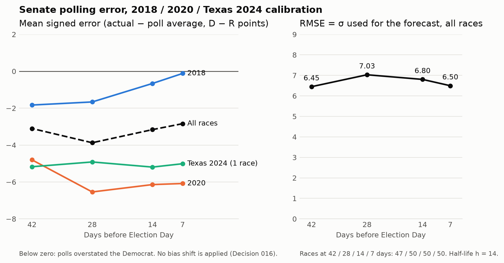

# 2026 Election Modeling

A polling-based forecast of the 2026 Texas U.S. Senate race: a recency-weighted average of likely-voter polls, turned into a win probability using polling errors from past Senate races.

## Current forecast

**P(Talarico wins) = 71.3%**, as of 2026-10-08, from tracker snapshot [`20261008T042800Z`](data/raw/texas_tracker/20261008T042800Z/).

| Input | Value |
| --- | --- |
| Weighted average, Democrat minus Republican | +3.95 points |
| Likely-voter polls / effective number (n_eff) | 14 / 6.71 |
| Half-life h | 14 days |
| σ (calibration RMSE at the 28-day horizon) | 7.03 points |

The first forecast, from the `20261006T023757Z` snapshot, was 68.1%. This is the Tier 1 deliverable (Decision 010): one race, run on demand.

## Method

- **Polls:** Texas Politics Project tracker, likely-voter polls only. Margin = Democratic % − Republican %, undecided left as reported, repeat polls kept as separate observations (Decision 009).
- **Average:** each poll is weighted by 0.5^(age in days / 14), counting age from its fieldwork end date. The report includes n_eff = (Σw)² / Σw².
- **Uncertainty:** the error is the actual result margin minus the poll average, computed with the same rules at 7, 14, 28 and 42 days before Election Day, across 52 eligible 2018/2020 and Texas 2024 Senate contests. σ is the RMSE of those errors at the closest horizon (Decisions 012, 013).
- **Probability:** P(Democrat wins) = Φ(average / σ), with normal errors and no bias shift (Decisions 015, 016).

Full formulas and rules are in [docs/methodology.md](docs/methodology.md); every choice is logged in [docs/decisions.md](docs/decisions.md).

## Calibration

Error = actual margin − poll average (D − R, points); negative means the polls overstated the Democrat. Half-life h = 14.

| Horizon (days) | Races | Mean error | RMSE (σ) |
| ---: | ---: | ---: | ---: |
| 7 | 50 | −2.84 | 6.50 |
| 14 | 50 | −3.16 | 6.80 |
| 28 | 50 | −3.87 | 7.03 |
| 42 | 47 | −3.10 | 6.45 |

Wyoming 2018/2020 have no qualifying polls at any horizon, and Delaware, Oregon and West Virginia 2020 have none at 42 days, so 11 contest-horizons are dropped. By cycle, mean error ranges from −0.1 to −1.8 in 2018 and from −4.8 to −6.5 in 2020.



### Sensitivity

**TODO (Rahan).** Compare P(D) with no shift against P(D) with the average shifted by the calibration mean error. Not computed yet.

## How to run

Requires Python 3.14 (developed on 3.14.1; the pinned requirements were checked on 3.14.5).

```bash
python3.14 -m venv .venv
source .venv/bin/activate
pip install -r requirements.txt

python -m src.model.run_texas            # prints the current forecast and calibration table
python -m pytest                         # 34 tests; or: python -B -m unittest discover -s tests
python -m src.evaluate.plot_calibration  # redraws docs/img/calibration_errors.png
```

The notebook [`notebooks/texas_forecast.ipynb`](notebooks/texas_forecast.ipynb) walks through the same steps; install Jupyter separately to open it. Data collection and preparation commands are in [docs/data_pipeline.md](docs/data_pipeline.md).

## Known limitations

- **Two cycles.** σ rests essentially on 2018 and 2020 (plus Texas 2024). The cycle-wide polling lean (about −1 in 2018, −6 in 2020) is the largest part of σ, and two draws of it are a weak basis. Adding 2022/2024 is approved (Decision 017) but blocked on archive downloads.
- **Uncalibrated half-life.** h = 14 days is a working value that hasn't been fit to historical data. The σ horizon (28 days) is also set by hand.
- **Thin races.** 13–21 calibration races per horizon have n_eff < 1.5 and are kept for now. West Virginia 2020 alone (one poll, error −23) moves σ at 7 days from 6.50 to about 5.65.
- **Unshifted bias.** Polls overstated Democrats by about 3 points on average, but the average is not shifted and σ stays the RMSE (Decision 016).
- **Possible leakage.** Polls are filtered by fieldwork end date, not publication date, so a poll fielded before a horizon but released after it can still leak in.

## Roadmap

From Decision 010:

1. **Minimum (done):** P(Democrat wins) for Texas Senate from a recency-weighted LV average and calibrated normal errors.
2. **Next:** add fundamentals and pollster house effects (including how to bring RV and partisan polls back in), make σ a smooth function of days to the election, and extend to more races (Georgia and Michigan are tentative).
3. **Final:** model correlation between states, cover the full 2026 Senate map, and produce P(Democrats win the Senate).

Decision 018 adds national and generic-ballot polls as lower-weight inputs to each state's forecast, adjusted for the state's partisan lean. The weights and method are undecided.

Near-term: sensitivity checks (half-life, t-distributed errors, thin races), automatic horizon selection, and 2022/2024 calibration cycles. See [STATUS.md](STATUS.md).

## Who did what

I (Rahan Arasteh) wrote the weighting, uncertainty and calibration logic. AI assistants did data collection, cleaning, infrastructure and review, as set out in [docs/process/PROJECT.md](docs/process/PROJECT.md).

---

Repository: https://github.com/arasteh-git/election-modeling · Current state: [STATUS.md](STATUS.md) · File map: [docs/file_guide.md](docs/file_guide.md)
